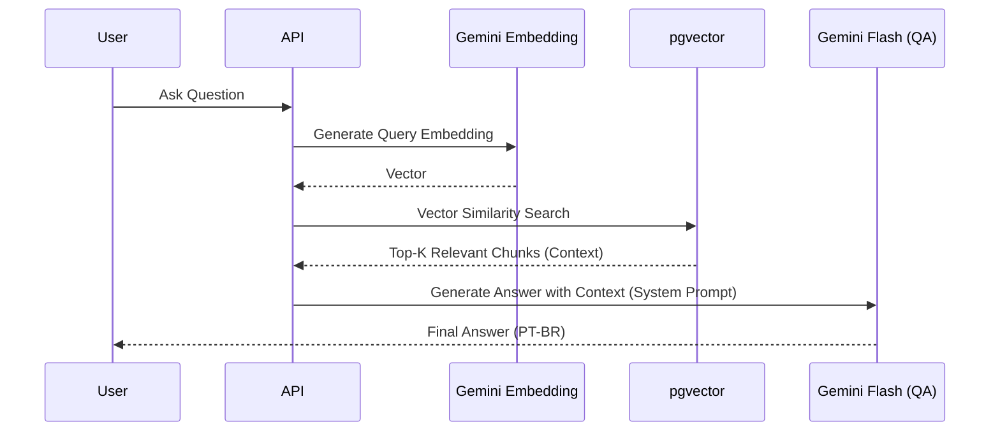

# Query Flow (POST /query)

```mermaid
sequenceDiagram
    participant U as User
    participant A as API
    participant E as Gemini Embedding
    participant V as pgvector
    participant Q as Gemini Flash (QA)

    U->>A: Ask Question
    A->>E: Generate Query Embedding
    E-->>A: Vector
    A->>V: Vector Similarity Search
    V-->>A: Top-K Relevant Chunks (Context)
    A->>Q: Generate Answer with Context (System Prompt)
    Q-->>U: Final Answer (PT-BR)
```
