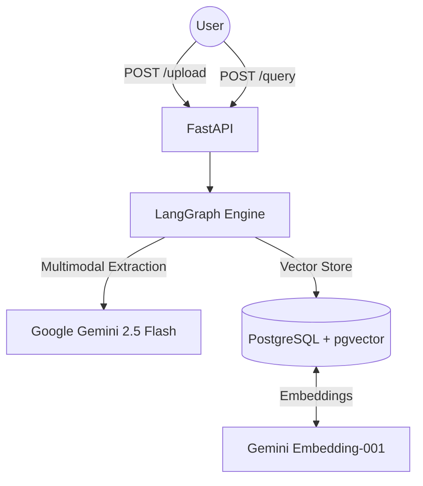

# System Architecture

```mermaid
graph TD
    User((User))
    API[FastAPI]
    Graph[LangGraph Engine]
    Gemini[Google Gemini 2.5 Flash]
    Embed[Gemini Embedding-001]
    DB[(PostgreSQL + pgvector)]

    User -->|POST /upload| API
    User -->|POST /query| API
    
    API --> Graph
    Graph -->|Multimodal Extraction| Gemini
    Graph -->|Vector Store| DB
    DB <-->|Embeddings| Embed
```
