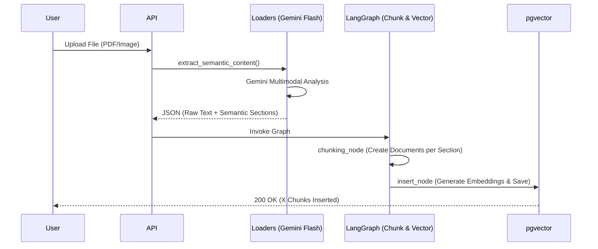

# Ingestion Flow (POST /upload)

```mermaid
sequenceDiagram
    participant U as User
    participant A as API
    participant L as Loaders (Gemini Flash)
    participant G as LangGraph (Chunk & Vector)
    participant V as pgvector

    U->>A: Upload File (PDF/Image)
    A->>L: extract_semantic_content()
    L->>L: Gemini Multimodal Analysis
    L-->>A: JSON (Raw Text + Semantic Sections)
    A->>G: Invoke Graph
    G->>G: chunking_node (Create Documents per Section)
    G->>V: insert_node (Generate Embeddings & Save)
    V-->>U: 200 OK (X Chunks Inserted)
```
